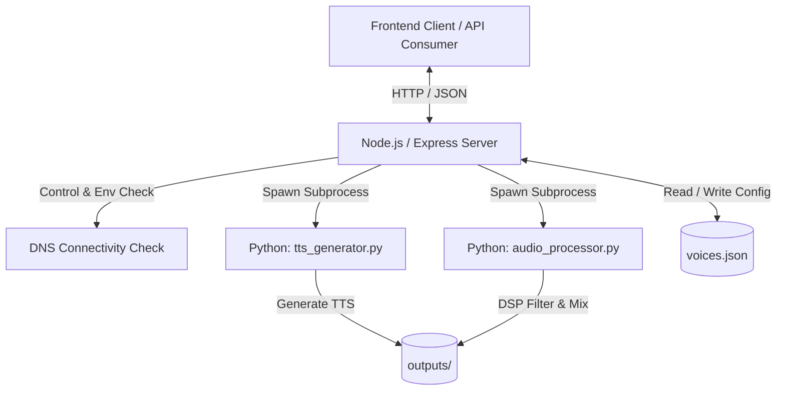

# 🎙️ URA +Inteligente — TTS Studio Backend

[](https://nodejs.org/)
[](https://www.python.org/)
[](https://expressjs.com/)
[](#)

Este é o microsserviço de backend do **TTS Studio (URA +Inteligente)**. Trata-se de uma arquitetura híbrida de alto desempenho que combina a agilidade do **Node.js** para orquestração de APIs HTTP com o poder do **Python** para processamento digital de sinais (DSP) e síntese de voz (TTS). 

O serviço é especializado na geração de áudios de atendimento para sistemas de telefonia (URA / IVR), permitindo a conversão de texto em fala de forma online (Vozes Neurais via `edge-tts`) ou offline (`gTTS`), com pós-processamento de áudio (equalização, reverberação e mixagem de música de fundo) e exportação em formatos específicos de telecomunicações (ex: WAV 8kHz 8-bit mono).

---

## 🏗️ Arquitetura do Sistema



---

## 🚀 Funcionalidades Principais

*   **Síntese Híbrida de Voz (TTS):** 
    *   **Modo Online (Neural):** Integração com `edge-tts` para vozes neurais realistas e fluidas de Inteligência Artificial da Microsoft.
    *   **Modo Offline:** Fallback automático para `gTTS` caso o microsserviço detecte perda de conectividade com a internet.
*   **Processamento Digital de Sinais (DSP) de Áudio:**
    *   Equalização paramétrica (`eq`) customizável.
    *   Efeito de Reverberação (`reverb`) e decaimento configuráveis.
    *   Mixagem de trilha sonora/música de fundo (`music-vol`, `music-start`, `music-duration`).
*   **Exportação Otimizada para Telecom:**
    *   Conversão para formatos padrão de centrais telefônicas analógicas e digitais:
        *   `mp3`: Consumo geral.
        *   `wav16k`: WAV PCM 16kHz de alta fidelidade.
        *   `wav8k8bit`: WAV PCM 8kHz 8-bit Mono (padrão legante de URA / Asterisk / centrais IP).

---

## 🛠️ Pré-requisitos e Dependências

Para rodar o microsserviço localmente ou em contêineres, você precisará dos seguintes runtimes instalados:

1.  **Node.js** (Versão 18.x ou superior recomendada)
2.  **Python** (Versão 3.9 ou superior recomendada)
3.  **FFmpeg** (Obrigatório no sistema para que a biblioteca `pydub` em Python consiga ler/escrever formatos de áudio variados como MP3 e realizar a conversão de frequências).
    *   *Windows*: Baixe via [gyan.dev](https://www.gyan.dev/ffmpeg/builds/) e adicione a pasta `bin` ao `PATH` do sistema.
    *   *Linux*: `sudo apt install ffmpeg`

---

## 📦 Instalação e Configuração

### 1. Clonar o repositório
```bash
git clone https://github.com/thiagoalage-alt/ura-service.git
cd ura-service
```

### 2. Instalar as dependências do Node.js
```bash
npm install
```

### 3. Instalar as dependências do Python
Recomenda-se o uso de um ambiente virtual (`venv`):
```bash
# Criar ambiente virtual
python -m venv .venv

# Ativar ambiente virtual
# No Windows (PowerShell):
.venv\Scripts\Activate.ps1
# No Linux/macOS:
source .venv/bin/activate

# Instalar dependências
pip install -r requirements.txt
```

### 4. Configurar as Variáveis de Ambiente (`.env`)
Crie um arquivo `.env` na raiz do projeto com as seguintes chaves de configuração:

```ini
PORT=3050
STATIC_PREFIX=/ura

# Caminhos do Python (Ajuste conforme o seu ambiente virtual se necessário)
PYTHON_BIN=python
PYTHON_TTS_SCRIPT=./scripts/tts_generator.py

# Diretórios locais para armazenamento de arquivos
OUTPUTS_DIR=./outputs
UPLOADS_DIR=./uploads
VOICES_FILE=./voices.json
```

---

## 🔌 API Endpoints (Referência Rápida)

Todos os endpoints são prefixados pelo valor configurado em `STATIC_PREFIX` (padrão: `/ura`).

| Método | Rota | Descrição |
| :--- | :--- | :--- |
| `GET` | `/ura/status` | Retorna o status de integridade da API e a versão atual. |
| `GET` | `/ura/connectivity` | Verifica a conectividade externa e determina se usará o motor Neural (online) ou Google (offline). |
| `GET` | `/ura/voices` | Retorna a lista de vozes neurais e locais pré-configuradas no `voices.json`. |
| `GET` | `/ura/samples-health` | Monitora a existência e contagem de amostras de áudio na pasta global. |
| `POST` | `/ura/generate` | Converte texto em arquivo de áudio (TTS) com controle de tom (`pitch`) e taxa de fala (`rate`). |
| `POST` | `/ura/upload-music` | Recebe um arquivo de áudio via `multipart/form-data` para servir de música de fundo. |
| `POST` | `/ura/process` | Aplica filtros DSP (equalização, reverb e mixagem com música de fundo) e exporta no formato desejado. |
| `GET` | `/ura/download/:filename` | Endpoint de download / streaming do arquivo de áudio gerado pelo servidor. |

---

## 📝 Exemplos de Payload HTTP

### 1. Gerar Áudio (TTS)
*   **POST** `/ura/generate`
*   **Payload (JSON):**
    ```json
    {
      "text": "Seja bem-vindo ao suporte técnico de incidentes. Digite 1 para falar com um atendente.",
      "voice": "pt-BR-FranciscaNeural",
      "rate": "+0%",
      "pitch": "+0Hz"
    }
    ```
*   **Resposta (JSON):**
    ```json
    {
      "url": "http://localhost:3050/ura/download/20260526_pt-BR-FranciscaNeural_d58a1f29.mp3",
      "filename": "20260526_pt-BR-FranciscaNeural_d58a1f29.mp3",
      "engine": "edge-tts"
    }
    ```

### 2. Processar Áudio (DSP, Equalização, Reverb, Conversão de Formato)
*   **POST** `/ura/process`
*   **Payload (JSON):**
    ```json
    {
      "input_filename": "20260526_pt-BR-FranciscaNeural_d58a1f29.mp3",
      "format": "wav8k8bit",
      "eq": {
        "bass": 3,
        "mid": -1,
        "treble": 4
      },
      "reverb": 0.15,
      "reverb_decay": 0.4,
      "music_id": "musica_espera_123.mp3",
      "music_vol": 0.15,
      "music_start": 0,
      "music_duration": 15
    }
    ```
*   **Resposta (JSON):**
    ```json
    {
      "url": "http://localhost:3050/ura/download/proc_20260526_af39b821.wav",
      "filename": "proc_20260526_af39b821.wav",
      "format": "wav8k8bit"
    }
    ```

---

## 🏃 Executando a Aplicação

### Modo de Desenvolvimento (Watch Mode)
O servidor irá monitorar alterações nos arquivos e se reiniciar automaticamente:
```bash
npm run dev
```

### Modo de Produção
```bash
npm start
```

---

## 📁 Estrutura de Diretórios

```text
ura-service/
├── frontend/             # Código estático do painel visual (opcional)
├── outputs/              # Áudios gerados pelo TTS e pós-processados
├── uploads/              # Músicas de fundo carregadas pelos usuários
├── scripts/              # Scripts Python para TTS e Engenharia de Áudio
│   ├── tts_generator.py
│   └── audio_processor.py
├── .gitignore            # Regras de exclusão do Git
├── package.json          # Manifesto do projeto Node.js
├── requirements.txt      # Manifesto de dependências do Python
├── server.js             # Ponto de entrada do backend do microsserviço
└── voices.json           # Cadastro de vozes disponíveis
```
